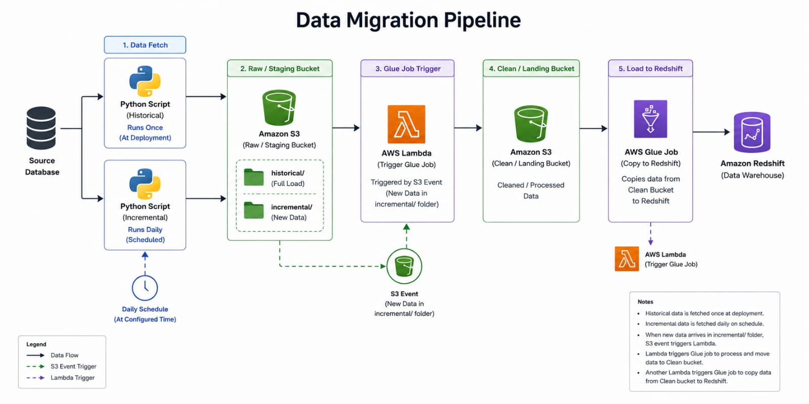

# 🚀 Film Data Migration & ETL Pipeline (AWS Glue + Redshift)

<div align="center">


**An end-to-end AWS data engineering pipeline that migrates a relational MySQL database into a cleaned, star-schema data warehouse on Amazon Redshift — built with S3, Lambda, AWS Glue (PySpark), and event-driven automation.**

</div>

---

## 📌 Table of Contents

- [Overview](#overview)
- [Problem Statement](#problem-statement)
- [Dataset](#dataset)
- [Pipeline Architecture](#pipeline-architecture)
- [Tools & Technologies](#tools--technologies)
- [Methods](#methods)
- [Pipeline Stages](#pipeline-stages)
- [Star Schema Design](#star-schema-design)
- [Results](#results)
- [How to Run](#how-to-run)
- [Conclusion](#conclusion)
- [Future Work](#future-work)
- [Author & Contact](#author--contact)

---

## 📊 Overview

This project implements a fully automated, event-driven **ETL pipeline on AWS** that migrates a relational source database (the **Film** sample database — actors, films, customers, rentals, payments, and store/staff data) from raw extracts into a clean, query-ready **star schema** in **Amazon Redshift**.

The pipeline:

- Performs both a one-time **historical load** and a **scheduled incremental load** from the source database
- Lands raw data in S3, automatically triggers cleaning via Lambda + AWS Glue
- Cleans, standardizes, and deduplicates every table using PySpark
- Re-models the cleaned "snowflake" schema into a **star schema** (dimensions + fact table) optimized for analytics
- Loads the final tables into Redshift for BI / reporting consumption

---

## ❓ Problem Statement

Raw operational data extracted from a relational database is rarely analytics-ready: column names are inconsistent, timestamps are stored as strings, nulls and duplicates creep in, and the schema itself is normalized for transactions rather than reporting. This project addresses:

- How do you move data out of a source database on both a historical and ongoing incremental basis?
- How do you automatically trigger downstream processing the moment new data lands, without manual intervention?
- How do you standardize and clean dozens of raw tables consistently, at scale?
- How do you re-model a normalized (snowflake) schema into a star schema that BI tools and analysts can query efficiently?
- How do you get the final tables into a warehouse like Redshift in a repeatable, automated way?

---

## 🗃️ Dataset

The pipeline is built and tested against the **Film** sample database (a MySQL reference dataset modeling a DVD rental business), extracted into **16 relational CSV tables**:

| Table | Description |
|-------|-------------|
| `customer` | Customer master data (name, email, address, active status) |
| `address`, `city`, `country` | Snowflaked location hierarchy |
| `film`, `film_category`, `category`, `language` | Film catalog and classification |
| `film_actor`, `actor` | Film-to-actor mapping |
| `store`, `staff` | Store and staff/manager data |
| `inventory` | Physical copies of films per store |
| `rental` | Rental transactions |
| `payment` | Payment transactions |
| `film_text` | Searchable film title/description |

### Summary Statistics

| Metric | Value |
|--------|-------|
| Source Tables | 16 |
| Customers | 599 |
| Films | 1,000 |
| Rentals | 16,044 |
| Payments | 16,044 |
| Stores | 2 |
| Inventory Items | 4,581 |

---

## 🗺️ Pipeline Architecture

The pipeline follows a classic **raw → clean → warehouse** lakehouse pattern, fully automated through S3 events and Lambda triggers:



**Flow summary:**

1. Python scripts extract data from the source database — one historical (full load, runs once at deployment) and one incremental (runs daily on a schedule)
2. Both land in an S3 **raw/staging bucket**, partitioned into `historical/` and `incremental/` folders
3. New data arriving in `incremental/` fires an **S3 event**, which triggers a **Lambda function**
4. Lambda invokes an **AWS Glue job** that cleans the raw data and writes it to a **clean/landing S3 bucket**
5. A second Lambda/Glue job copies the cleaned, star-schema-modeled tables from the clean bucket into **Amazon Redshift** via JDBC `COPY`

---

## 🛠️ Tools & Technologies

| Category | Tools |
|----------|-------|
| **Source Database** | MySQL (Film database) |
| **Orchestration / Extraction** | Python, boto3 |
| **Storage** | Amazon S3 (raw + clean buckets) |
| **Event Automation** | AWS Lambda, S3 Event Notifications |
| **Transformation Engine** | AWS Glue (PySpark / Spark SQL) |
| **Data Warehouse** | Amazon Redshift (JDBC / COPY) |
| **Schema Design** | Star Schema (dimensions + fact table) |
| **Access Control** | AWS IAM roles |

---

## ⚙️ Methods

### 1. Data Extraction
- Parsed the MySQL Sakila dump (`film-schema.sql` + `film-data.sql`) into 16 structured CSV tables
- Preserved column types, handled MySQL-specific literals (hex BLOBs, conditional version comments) during extraction

### 2. Data Cleaning (`glue_pyspark_clean.py`)
```python
# Core cleaning steps applied to every table
- Normalize column names to snake_case
- Trim whitespace on all string columns
- Cast date/update columns to TimestampType
- Convert empty strings to NULL, then:
    - Fill numeric NULLs with 0
    - Fill string NULLs with ""
- Drop fully-NULL ("zombie") rows
- Drop exact duplicate rows
```

### 3. Star Schema Transformation (`glue_snowflake_to_star.py`)
- Re-cleans each source table, then joins across the snowflaked relationships to build:
  - `dim_customer` — customer + address + city + country (flattened)
  - `dim_film` — film + category + language (flattened)
  - `dim_store` — store + staff (manager) + city + country (flattened)
  - `dim_date` — generated calendar dimension from distinct payment dates
  - `fact_payment` — payment + rental + inventory, resolved to all dimension keys

### 4. Load to Redshift
- Each dimension table is loaded in `overwrite` mode (always reflects latest state)
- The fact table is loaded in `append` mode (accumulates new daily payments)
- Data is staged through a temp S3 path and bulk-loaded via Redshift `COPY`

---

## 📋 Pipeline Stages

### Stage 1 — Data Fetch
> Historical script runs once at deployment for a full load; incremental script runs daily on a schedule to capture new records.

### Stage 2 — Raw / Staging Bucket
> Amazon S3 bucket holding raw, untouched extracts in `historical/` and `incremental/` folders.

### Stage 3 — Glue Job Trigger
> An S3 event on new data in `incremental/` invokes a Lambda function, which starts the cleaning Glue job — no manual scheduling needed.

### Stage 4 — Clean / Landing Bucket
> Output of the Glue cleaning job: standardized column names, parsed timestamps, no nulls or duplicates.

### Stage 5 — Load to Redshift
> A second Glue job builds the star schema and copies dimension + fact tables into Redshift, triggered by its own Lambda.

---

## ⭐ Star Schema Design

```
                dim_customer
                     │
dim_date ── fact_payment ── dim_film
                     │
                dim_store
```

| Table | Grain | Row Count (sample run) |
|-------|-------|------------------------|
| `dim_customer` | 1 row per customer | 599 |
| `dim_film` | 1 row per film | 1,000 |
| `dim_store` | 1 row per store | 2 |
| `dim_date` | 1 row per distinct payment date | 41 |
| `fact_payment` | 1 row per payment | 16,044 |

---

## 📈 Results

- **16 raw tables** successfully extracted, cleaned, and standardized with zero data loss
- **0 zombie rows** and **0 exact duplicates** found in the cleaned Sakila dataset — confirming the source extract was already consistent
- Star schema build resolved all foreign keys correctly: every `fact_payment` row carries a valid `customer_id`, `film_id`, `store_id`, and `date_id`
- Identified and fixed **2 column-ambiguity bugs** in the join logic during testing (a mis-specified join condition in `dim_store`, and a duplicate `customer_id` column carried into `fact_payment`) — both caught by Spark's `AMBIGUOUS_REFERENCE` analysis errors and resolved before reaching Redshift

---

## 🚀 How to Run

### Prerequisites
- Python 3.10+ with `pyspark`, `boto3`
- Java 11/17/21 (required by Spark)
- An AWS account with S3, Lambda, Glue, and Redshift configured (for full cloud deployment) — or run the Glue scripts locally against local CSVs for testing

### Steps

```bash
# 1. Clone the repository
git clone https://github.com/your-username/sakila-etl-pipeline

# 2. Extract the source data into CSVs
python extract_sakila_to_csv.py

# 3. Run the cleaning job
python glue_pyspark_clean.py

# 4. Run the star-schema build job
python glue_snowflake_to_star.py

# 5. (Cloud) Deploy as AWS Glue jobs with the appropriate
#    --SOURCE_BUCKET, --REDSHIFT_URL, and --REDSHIFT_IAM_ROLE parameters
```

---

## 🏁 Conclusion

This project demonstrates a complete, automated AWS ETL pattern — from raw database extraction through event-driven cleaning to a fully modeled star schema in Redshift. It shows practical handling of real-world data engineering challenges: incremental vs. historical loads, event-driven orchestration, schema normalization/cleaning at scale, and dimensional modeling for analytics.

---

## 🔮 Future Work

- [ ] Replace manual Lambda triggers with **AWS Step Functions** for full pipeline orchestration
- [ ] Add **data quality testing** (e.g. Great Expectations / Deequ) between pipeline stages
- [ ] Implement **incremental merge/upsert (SCD Type 2)** logic for dimension tables
- [ ] Add **CloudWatch alerting** for job failures
- [ ] Containerize the Glue job logic for local testing via Docker
- [ ] Build a Power BI / QuickSight dashboard on top of the Redshift star schema

---

## 👤 Author & Contact

### [Harshal Patil]
**Role:** Data Engineer

| Skill | Proficiency |
|-------|-------------|
| AWS (S3, Lambda, Glue, Redshift) | ⭐⭐⭐⭐ |
| PySpark / Spark SQL | ⭐⭐⭐⭐ |
| Python | ⭐⭐⭐⭐ |
| SQL | ⭐⭐⭐⭐ |
| Data Modeling (Star Schema) | ⭐⭐⭐⭐ |

[](https://github.com/harsh-8830)
[](https://linkedin.com/in/harshal-patil-6b7207359)

---

<div align="center">

⭐ **If you found this project helpful, please give it a star!** ⭐

</div>
